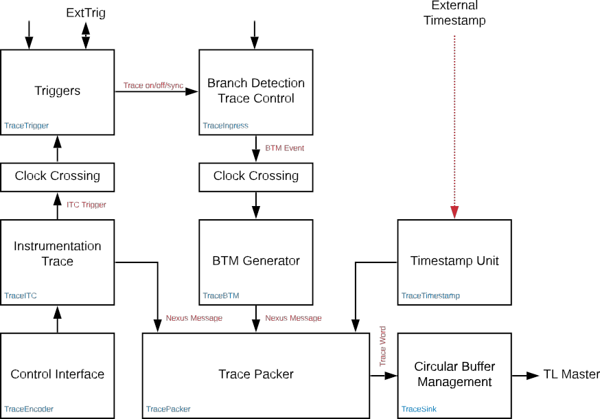
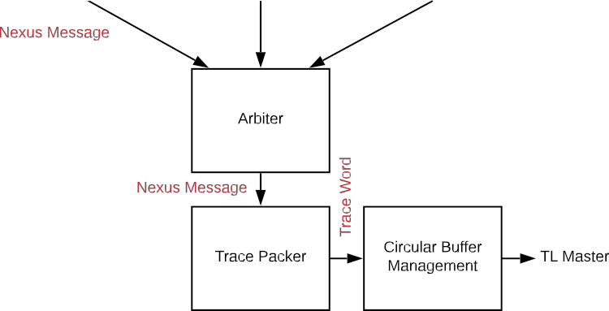

***P550's trace system is built with a pre-ratified Spec. Control fields differ from ratified version (1.0)***

## Trace System

## Table Core to Trace Encoder Interface
| Trace Spec Signal | TE Signal | Description |
| ----------------- | --------- | ----------- |
| — | clock | Core clock |
| reset | reset | Core is in reset (does not reset TE) |
| iretire | valid | 1 indicates an instruction has retired |
| iexception | exception | 1 indicates an exception |
| interrupt | interrupt | 1 indicates an interrupt |
| iaddr[63:0] | iaddr[63:0] | If iretire=1, the instruction address |
| instr[31:0] | insn[31:0] | If iretire=1, the instruction opcode |
| priv[2:0] | priv[2:0] | If iretire=1, the privilege mode: • 0x0 - User mode • 0x1 - Supervisor mode • 0x3 - Machine mode • 0x4-0x7 - Debug mode |
| — | bpwatch[n:0] | Core watchpoint actions, 4 bits per watchpoint: • valid: this watchpoint is matching in this cycle • action[2:0]: action field for this watchpoint |
| stall | teStall | Stall input to core |

## Table Trace Encoder Memory Map
| Offset | TE Name | TF Name         | Description |
| ------ | ------- | --------------- | ----------- |
| 0x0000 | teControl | tfControl | Trace Encoder/Funnel control register |
| 0x0004 | teImpl | tfImpl | Trace Encoder/Funnel implementation information |
| 0x0010 | teSinkBase | teSinkBase | Base address of circular trace buffer |
| 0x0014 | teSinkBaseHigh | teSinkBaseHigh | Bits [N:32] of the circular buffer address  where N is equal to the most significant bit of the physical address |
| 0x0018 | teSinkLimit | teSinkLimit | End address of circular trace buffer |
| 0x001C | teSinkWP | teSinkWP | Current write location for trace data in circular buffer |
| 0x0040 | tsControl | tsControl | Timestamp control register |
| 0x0044 | tsLower | tsLower | Lower 32 bits of timestamp counter |
| 0x0048 | tsUpper | tsUpper | Upper bits of timestamp counter |
| 0x0050 | xtiControl | — | External Trigger Input control register |
| 0x0054 | xtoControl | — | External Trigger Output control register|
| 0x0058 | wpControl | — | Core watchpoint control register |
| 0x0060 | itcTraceEnable | — | ITC trace enable bits, 1 bit per virtual stimulus register |
| 0x0064 | itcTrigEnable | — | ITC trigger enable bits, 1 bit per virtual stimulus register |
| 0x0080–0x00FF | itcStimulus | — | Instrumentation Trace stimulus 0 to 31 |
| 0x0100–0x01FF | pcSample | — | Register interface to PC Sampling Unit, if present |

## Table Trace Encoder Control Register (teControl)
| Bits | Field Name | Attr. | Rst. | Description |
| ---- | ---------- | ----- | ---- | ----------- |
| 0 | teActive | RW | 0x0 | Master enable for trace system. 0 resets the TE and clocks may be gated off.  teActive must be set to 1 before any other registers (except pcControl),  including other fields in teControl, are programmed. |
| 1 | teEnable | RW | 0x0 | 1=TE enabled. Allows teTracing to turn all tracing on and off.  Setting teEnable to 0 flushes any queued trace data to the designated sink. |
| 2 | teTracing | RW | 0x0 | 1=Trace is being generated. Written from tool or controlled by triggers.  Note that this field is volatile and may be masked in IP-XACT. |
| 3 | teEmpty | RO | 0x1 | Reads as 1 when all generated trace has been emitted.  Note that this field is volatile and may be masked in IP-XACT. |
| [6:4] | teInstruction | WARL | 0x0 | Instruction trace generation parameters: • 0x0 - Don’t generate BTM or Sync (no instruction trace) • 0x1 - Event trace mode • 0x2 - Reserved • 0x3 - Reserved • 0x4-0x5 - Reserved • 0x6 - Generate HTM and Sync without HTM optimizations • 0x7 - Generate HTM and Sync with full optimization |
| [8:7] | teInstrumentation | RW | 0x0 | ITC trace generation parameters for itcStimulus registers  whose corresponding itcTraceEnable=1. • 0x0 - ITC trace disabled • 0x1 - Generate ITC messages for all itcStimulus registers • 0x2 - Generate Ownership message for itcStimulus[15, 31],  disabling other ITC trace • 0x3 - Generate Ownership message for itcStimulus[15, 31],  and ITC messages for all other itcStimulus registers |
| [11:9] | Reserved | RO | 0x0 | |
| 12| teStallOrOverflow | RW | 0x0 | Written to 1 by hardware when an overflow message is generated or when  the TE requests a core stall. Debugger can write 0 to clear.  Note that this field is volatile and may be masked in IP-XACT. |
| 13 | teStallEnable | RW | 0x0 | 0=If TE cannot accept a message, an overflow is generated.  1=If TE cannot accept a message, the core is stalled until it can. |
| 14 | teStopOnWrap | RW | 0x0 | Disable trace (teEnable → 0) when circular buffer fills for the first time.  Present only in systems with SRAM or System Memory sinks.|
| 15 | teInhibitSrc | RW | 0x0 | 1=Disable SRC field in Nexus messages. Unless disabled,  a SRC field of teImpl.nSrcBits is added to every Nexus message to  indicate which TE generated each message. |
| [19:16] | teSyncMaxBTM | WARL | 0x3 | Maximum number of BTMs between periodic Sync messages.  A Sync emitted for another reason will reset this timer. • 0x0-0xB - Generate Sync after 2^(teSyncMaxBTM + 5)^ BTM’s.  Range is 32 to 65536. Default is 256. • 0xC-0xE - Reserved • 0xF - Off. Do not generate a Sync message due to a count of BTMs. |
| [23:20] | teSyncMaxInst | WARL | 0xA |Maximum I-CNT between BTMs.  A BTM emitted for another reason will reset this timer.  • 0x0-0x5 - Generate Sync when running I-CNT reaches 2^(teSyncMaxInst+5)  bytes. Range is 32 to 1024 bytes. Default is 1024. • 0x6-0xE - Reserved • 0xF - Off. Do not generate a Sync message due to instruction or cycle count. |
| [26:24] | teSliceFormat | RO | 0x1 | Nexus Slice Format  • 0x0 - Reserved • 0x1 - 6 MDO + 2 MSEO • 0x2-0x7 - Reserved |
| 27 | teSinkError | RW1C | 0x0 |Hardware sets this to 1 when a trace sink TileLink transaction results in an error.  This can happen with a System Memory sink when the address or size is invalid  or with PIB, ATB, and Funnel sinks when the destination device is disabled.  Write 1 to clear.  Note that this field is volatile and may be masked in IP-XACT. |
| [31:28] | teSink | WARL | 0x8 | Which sink to send trace to. If there is only one sink type,  this field may read as either 0 or that sink’s type number:  • 0x0 - Send trace to the one sink connected • 0x1-0x3 - Reserved • 0x5 - SRAM Sink • 0x5 - ATB Sink • 0x6 - PIB Sink • 0x7 - SBA Sink • 0x8 - Funnel Sink • 0x9-0xF - Reserved |

## Table Trace Encoder Implementation Register (teImpl)
| Bits | Field Name | Attr. | Rst. | Description |
| ---- | ---------- | ----- | ---- | ----------- |
| [3:0] | version | RO | 0x0 | TE Version (0 is this version) |
| 4 | hasSRAMSink | RO | 0x0 | 1 if this TE has an on-chip SRAM sink. Size of SRAM may be determined by  writing all 1sto teSinkWP, then reading the value back. |
| 5 | hasATBSink| RO | 0x0 | 1 if this TE has an ATB sink. |
| 6 | hasPIBSink | RO | 0x0 | 1 if this TE has an off-chip trace port via a Probe Interface Block. |
| 7 | hasSBASink | RO | 0x0 | 1 if this TE has an on-chip bus master through the Front Port. |
| 8 | hasFunnelSink | RO | 0x1 | 1 if this TE feeds into a Trace Funnel device. |
| [15:9] | Reserved | RO | 0x0 | |
| [17:16] | sinkBytes| RO | 0x0 | Width of this TE’s trace sink. • 0x0 - 32-bit • 0x1 - 64-bit • 0x2 - 128-bit • 0x3 - 256-bit |
| [19:18] | crossingType | RO | preset | Type of clock crossing between Ingress and BTM Generator. • 0x0 - Synchronous • 0x1 - Rational • 0x2 - Asynchronous |
| [23:20] | srcID | RO | preset | This TE’s source ID. If nSrcBits>0 and SRC is not disabled by teInhibitSrc,  then Nexus messages will all include a SRC field of nSrcBits bits.  Messages from this TE will have this value in SRC. |
| [26:24] | nSrcBits | RO | preset | The number of bits in the Nexus SRC field, unless disabled by teInhibitSrc. |
| 27 | Reserved | RO | 0x0 | |
| [31:28] | hartid | RO | preset | The hartid of the hart this TE is connected to.  Note that this field is volatile and may be masked in IP-XACT. |

## Table Trace Encoder Timestamp Control Register (tsControl)
| Bits | Field Name | Attr. | Rst. | Description |
| ---- | ---------- | ----- | ---- | ----------- |
| 0 | tsActive | RW | 0x0 | Master reset/enable for timestamp unit.  tsActive must be set to 1 before any other fields in tsControl are programmed. |
| [3:1] | Reserved | RO | 0x0 | |
| [6:4] | tsType | RO | 0x4 | Type of Timestamp unit • 0x0 - None • 0x1 - External • 0x2 - Internal, bus clock • 0x3 - Internal, core clock • 0x4 - Slave • 0x5-0x7 - Reserved |
| [14:7] | Reserved | RO | 0x0 | |
| 15 | tsEnable | RW | 0x0 | Enable timestamps and add timestamp field to Sync messages |
| [17:16] | tsBranch | WARL | 0x0 | Add timestamp field to branch messages if tsEnable=1. • 0x0 - No timestamp on branch messages • 0x1 - Timestamp all indirect branch and exception messages • 0x2 - Reserved • 0x3 - Timestamp all branch, exception, PTCM, and Error messages |
| 18 | tsInstrumentation | RW | 0x0  | Add timestamp field to Instrumentation messages if tsEnable=1 |
| 19 | tsOwnership | RW | 0x0 | Add timestamp field to Ownership messages if tsEnable=1 |
| [23:20] | Reserved | RO | 0x0 | |
| [31:24] | tsWidth | RO | 0x28 | Width of timestamp in bits |

## Trace Funnel

## Table Trace Funnel Control Register (tfControl)
| Bits | Field Name | Attr. | Rst. | Description |
| ---- | ---------- | ----- | ---- | ----------- |
| 0 | tfActive | RW | 0x0 | Master enable for trace funnel. 0 resets the TF and clocks may be gated off. |
| 1 | tfEnable | RW | 0x0 | 1 indicates TF enabled. Messages arriving via TileLink will be accepted, combined,  and sent to the designated sink. When the funnel is disabled, TileLink data will be  accepted but dropped. Setting tfEnable to 0x0 will flush any  partially filled trace words to the sink. |
| 2 | Reserved | RO | 0x0 | |
| 3 | tfEmpty | RO | 0x1 | Reads as 1 when all generated trace has been emitted. To stop trace, a debugger  would typically write 0 to tfEnable, then read tfEmpty until it reads as 1 indicating  all trace has been flushed.  Note that this field is volatile and may be masked in IP-XACT. |
| [13:4] | Reserved | RO | 0x0 | |
| 14 | tfStopOnWrap | RW | 0x0 | Disable trace (tfEnable → 0x0) when circular buffer fills for the first time.  Present only in systems with SRAM or System Memory sinks. |
| [26:15] | Reserved | RO | 0x0 | |
| 27 | tfSinkError | RW1C | 0x0 | Hardware sets this to 1 when a trace sink TileLink transaction results in an error.  This can happen with System Memory sink when the address or size is invalid or  with PIB, ATB, and Funnel sinks when the destination device is disabled.  Write 1 to clear.  Note that this field is volatile and may be masked in IP-XACT. |
| [31:28] | tfSink | WARL | 0x7 | • 0x0 - Send trace to the one sink connected • 0x1-0x3 - Reserved • 0x4 - SRAM Sink • 0x5 - ATB Sink • 0x6 - PIB Sink • 0x7 - SBA Sink • 0x8 - Funnel Sink • 0x9-0xF - Reserved |

## Table Trace Funnel Implementation Register (tfImpl)
| Bits | Field Name | Attr. | Rst. | Description |
| ---- | ---------- | ----- | ---- | ----------- |
| [3:0] | version | RW | 0x0 | Version (0 is this version). |
| 4 | hasSRAMSink | RO | 0x0 | 1 indicates TF enabled. Messages arriving via TileLink will be accepted, combined,  and sent to the designated sink. |
| 5 | hasATBSink | RO | 0x0 | 1 if this TF has an ATB sink |
| 6 | hasPIBSink | RO | 0x0 | 1 if this TF has an off-chip trace port via a Probe Interface Block |
| 7 | hasSBASink | RO | 0x1 | 1 if this TF has an on-chip bus master through the Front Port |
| 8 | hasFunnelSink | RO | 0x0 | 1 if this TF is a mid-level Funnel that feeds into another Funnel |
| [15:9] | Reserved | RO | 0x0 | |
| [17:16] | sinkBytes | RO | 0x1 | Width of this TF’s trace sink. 0x0 – 32 bit, 0x1 - 64 bit, 0x2 - 128 bit, 0x3 - 256 bit. |
| [31:18] | Reserved | RO | 0x0 | |

## Table Trace Funnel Sink Base Register (teSinkBase)
| Bits | Field Name | Attr. | Rst. | Description |
| ---- | ---------- | ----- | ---- | ----------- |
| [1:0] | Reserved | RO | 0x0 | |
| [N:2] | teSinkBase | RW | 0x0 | Base address of trace circular buffer relative to TF TileLink master node.  Fixed to the natural boundary implied by width of trace sink. |

## Table Trace Funnel Sink Base High Bits Register (teSinkBaseHigh)
| Bits | Field Name | Attr. | Rst. | Description |
| ---- | ---------- | ----- | ---- | ----------- |
| [N:0] | teSinkBaseH | RW | 0x0 | High order bits [N:32] of address of trace circular buffer in System Memory. |

## Table Trace Funnel Sink Limit Register (teSinkLimit)
| Bits | Field Name | Attr. | Rst. | Description |
| ---- | ---------- | ----- | ---- | ----------- |
| [1:0] | Reserved | RO | 0x0 | |
| [N:2] | teSinkLimit | RW | 0x0 |Highest address of trace circular buffer relative to TF TileLink master node.  Fixed to natural boundary. |

## Table Trace Funnel Sink Write Pointer Register (teSinkWP)
| Bits | Field Name | Attr. | Rst. | Description |
| ---- | ---------- | ----- | ---- | ----------- |
| 0 | teSinkWrapped | RW | 0x0 | Set to 1 by hardware when teSinkWP wraps.  Note that this field is volatile and may be masked in IP-XACT. |
| 1 | Reserved | RO | 0x0 | |
| [N:2] | teSinkWP | RW | 0x0 | Address in trace sink where next trace message will be written.  Fixed to natural boundary. When using a System Memory Sink and a trace word  write occurs while teSinkWP=teSinkLimit, teSinkWP is set to teSinkBase.  Note that this field is volatile and may be masked in IP-XACT. |

## Table Trace Funnel Timestamp Control Register (tsControl)
| Bits | Field Name | Attr. | Rst. | Description |
| ---- | ---------- | ----- | ---- | ----------- |
| 0 | tsActive | RW | 0x0 | Master reset/enable for timestamp unit.  tsActive must be set to 1 before any other fields in tsControl are programmed. |
| 1 | tsCount | RW | 0x0 | 1 for counter runs, 0 for counter stopped |
| 2 | tsReset | WO | X | Write 1 to reset the timestamp counter |
| 3 | Reserved | RO | 0x0 | |
| [6:4] | tsType | RO | 0x2 | Type of Timestamp unit • 0x0 - None • 0x1 - External • 0x2 - Internal, bus clock • 0x3 - Internal, core clock • 0x4 - Slave • 0x5-0x7 - Reserved |
| 7 | Reserved | RO | 0x0 | |
| [9:8] | tsPrescale | RW | 0x0 | Prescale timestamp clock by 22n (1, 4, 16, 64) |
| [23:10] | Reserved | RO | 0x0 | |
| [31:24] | tsWidth | RO | 0x28 | Width of timestamp in bits |

## Table Instrumentation Trace Enable Register (itcTraceEnable)
| Bits | Field Name | Attr. | Rst. | Description |
| ---- | ---------- | ----- | ---- | ----------- |
| [31:0] | itcTraceEnable | RW | 0x0 | 1=write to corresponding stimulus register generates DQM or  Ownership message if enabled by teInstrumentation|

## Table Instrumentation Trigger Enable Register (itcTrigEnable)
| Bits | Field Name | Attr. | Rst. | Description |
| ---- | ---------- | ----- | ---- | ----------- |
| [31:0] | itcTrigEnable | RW | 0x0 | 1=write to corresponding stimulus register causes an External Trigger Out.  The xtoEvent associated with a particular External Trigger Out must  also be enabled to generate a Trig Out. |

## Table Instrumentation Trace Stimulus Register (itcStimulus)
| Bits | Field Name | Attr. | Rst. | Description |
| ---- | ---------- | ----- | ---- | ----------- |
| [31:0] | itcStimulus | RW | 0x1 | Writes generate Nexus Data Acquisition Message (DQM) with data value and byte offset if  enabled by teInstrumentation and itcTraceEnable. Messages generated by writing to registers  0-15 (byte offset 0-63) do not include timestamps.   Registers 16-31 include a timestamp if ITC timestamping is enabled by teInstrumentation.  The byte offset generated by registers 16-31 will be 0-63. ITC supports full and partial word  writes.   To transmit a single byte through DQM, write the byte to offset 3 (bits [31:24]) in a register.  To transmit 2 bytes, do a halfword write to offset 2 (bits [31:16]). The byte offset field in the  DQM message will thereby indicate the size of the data value.   Registers 15 and 31 may be set to generate Ownership trace message or DQM using  teInstrumentation. A write to itcStimulus may also cause an External Trigger Out if  enabled by xtoEvent and itcTrigEnable.  Note that this field is volatile and may be masked in IP-XACT. |
